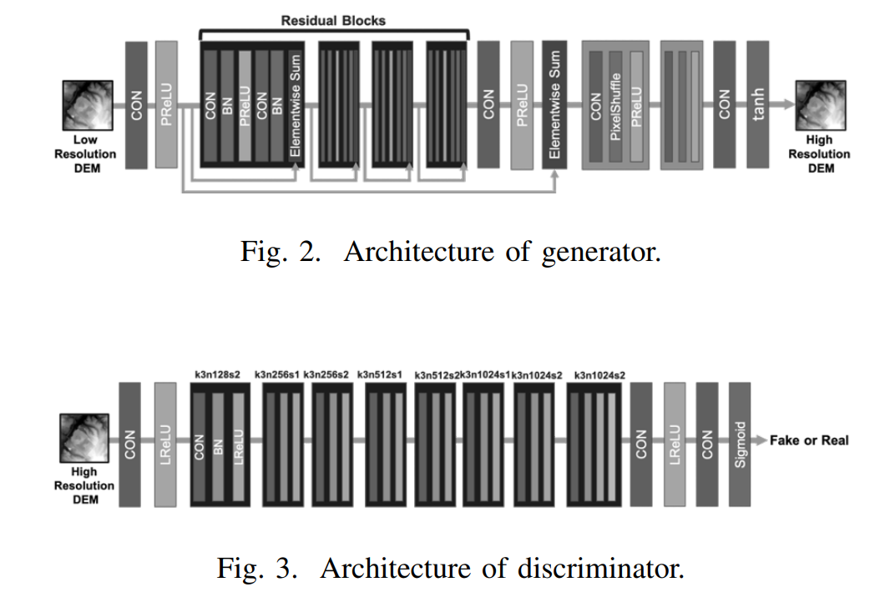

# D-SRGAN
### Implementation of D-SRGAN paper <a href="https://arxiv.org/pdf/2004.04788.pdf"> D-SRGAN: DEM Super-Resolution with Generative Adversarial Networks </a> ( Depth elevation map specific SRGAN for super resolution ) in Pytorch.

### generator and discriminator architecture : 

